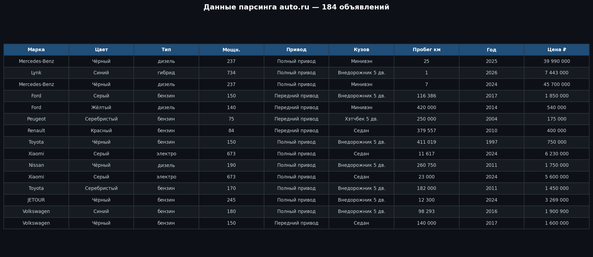
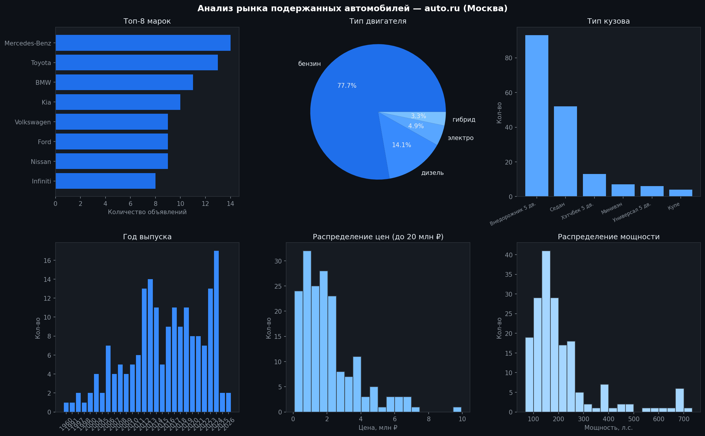
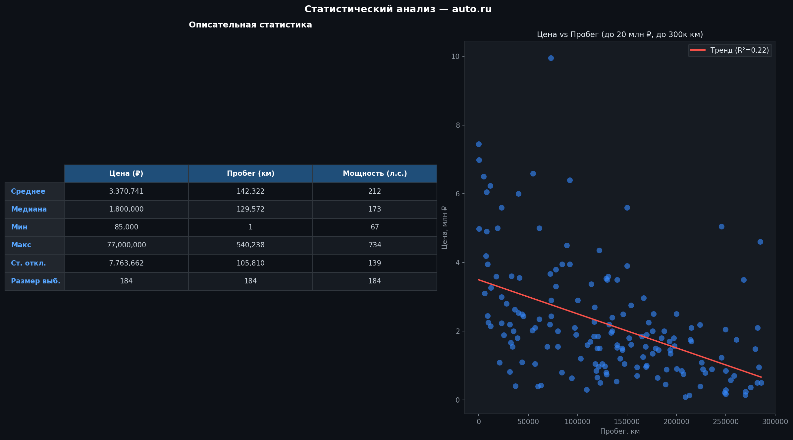

# Auto.ru Parser + Telegram Bot


Парсинг объявлений о продаже автомобилей с auto.ru, статистический анализ и
Telegram-бот который запускает весь сценарий по одной команде и возвращает PDF-отчёты.

---

## Что делает проект

**1. Парсинг** — собирает данные по подержанным авто из Москвы через Playwright:
марка, цвет, двигатель, мощность, привод, кузов, пробег, год, цена.

**2. Расчёты** — описательная статистика по выборке → PDF.

**3. Графики** — визуализация распределений и зависимостей → единый PDF.

**4. Статистический анализ** — полноценный анализ с содержательными выводами → PDF.

**5. Telegram-бот** — запускает весь сценарий по команде `/auto`,
возвращает 3 PDF прямо в чат.

---

## Скриншоты

### Результаты парсинга (sample CSV)


### Графики распределений


### Статистический анализ


---

## Стек

`Python 3.13` `Playwright` `pandas` `matplotlib` `scipy` `reportlab` `python-telegram-bot`

---

## Запуск

```bash
git clone https://github.com/MishanyaKudesnik/autoru-parser-bot.git
cd autoru-parser-bot
python -m venv .venv && source .venv/bin/activate
pip install -r requirements.txt
python -m playwright install chromium

# 1. Парсинг
python mishukov_01_parser.py --pages 5 --headful

# 2. Расчёты
python mishukov_02_calculations.py --input sample_data.csv

# 3. Графики
python mishukov_03_charts.py --input sample_data.csv

# 4. Статистика
python mishukov_04_statistics.py --input sample_data.csv

# 5. Telegram-бот
export TELEGRAM_BOT_TOKEN='ваш_токен'
python mishukov_05_telegram_bot.py
```

---

## Готовые результаты

В папке `results/` уже лежат PDF с реальными данными — можно смотреть без запуска:

- `results/task2/calculations.pdf` — расчёты по выборке
- `results/task3/charts.pdf` — графики
- `results/task4/statistics.pdf` — статистический анализ

---

## Структура

```
autoru-parser-bot/
├── mishukov_01_parser.py        # парсинг auto.ru через Playwright
├── mishukov_02_calculations.py  # описательная статистика
├── mishukov_03_charts.py        # графики → PDF
├── mishukov_04_statistics.py    # статистический анализ → PDF
├── mishukov_05_telegram_bot.py  # Telegram-бот
├── logging_utils.py             # логирование (5 уровней)
├── sample_data.csv              # пример собранных данных
├── results/                     # готовые PDF-отчёты
└── screenshots/
```

---

## Автор

**Михаил Мишуков** | РУТ МИИТ, направление ЦИТП
